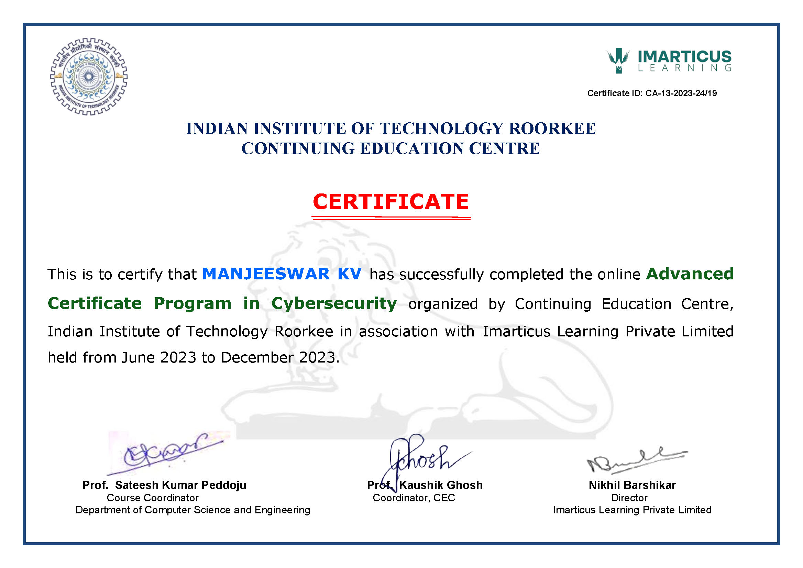

## 💻 Cybersecurity Portfolio

## 🔒 Professional Statement

I am pursuing a career in cybersecurity driven by a strong interest in protecting systems and data from evolving threats. I bring analytical thinking, attention to detail, and a commitment to continuous learning. With a foundation in Python, Linux, and cybersecurity tools, I am prepared to support secure, efficient environments. I value integrity, follow legal and ethical standards, and maintain professionalism through punctuality and reliability. My strengths and values align with the mission of organizations seeking trustworthy, skilled cybersecurity professionals. 🔐

## 🛠️ Tools

Here are some of the tools I use to secure systems and analyze threats:

- 🔍 Nmap
- 📊 Wireshark
- 🐧 Linux
- 🗄️ SQL Database

## 📑 Reports

Here are some of the key reports related to my cybersecurity projects and assessments:

- [Apply Filters to SQL Queries](./Reports/Apply%20Filters%20to%20SQL%20Queries.pdf)
- [DNS Incident Report](./Reports/dns-incident-report.pdf)
- [Incident Handler](./Reports/Incident%20Handler.pdf)
- [Internal IT Audit Botium](./Reports/internal-it-audit-botium.pdf)
- [OS Hardening Compromise Report](./Reports/os-hardening-compromise-report.pdf)
- [Project Description](./Reports/Project%20Description.pdf)
- [Recon Enumeration Lab Report](./Reports/Recon_Enumeration_Lab_Report.pdf)
- [Vulnerability Assessment Report](./Reports/Vulnerability%20Assessment%20Report.pdf)
- [Webserver DoS Summary](./Reports/webserver-dos-summary.pdf)

## 🎓 Certificates

Here are some of the certificates related to my cybersecurity expertise:

- 📜 [Google Cybersecurity Certificate](./Certificate/Google%20Cybersecurity%20Certificate.pdf)
- 🏅 

## 🌐 LinkedIn

Connect with me on LinkedIn: [www.linkedin.com/in/manjeeshkv](https://www.linkedin.com/in/manjeeshkv) 🔗
